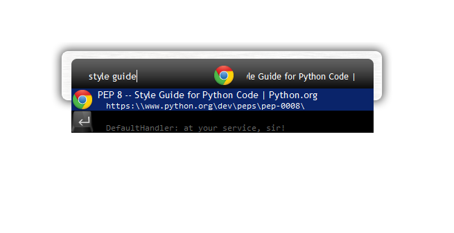
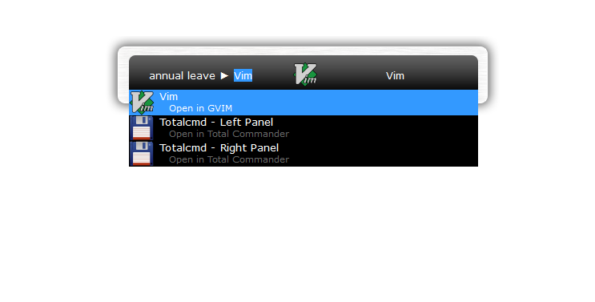

# Thruster

[Launchy](http://www.launchy.net/) is a free utility designed to help you forget about your start
menu, your desktop icons, and your file manager. Launchy indexes and launches your applications,
documents, project files, folders, and bookmarks with just a few keystrokes!

**Thruster** is an _all in one_ plugin for Launchy, you don't need any other launchy plugins
anymore, I say this because it is true: Thruster is written in Python and Python is simple and
flexible, when ideas come to your mind but not available in Launchy, just extend **Thruster.py** by
yourself or send me an request.

## Installation

Thruster is available on Windows only.

```cmd
# Run installer.bat
~> installer.bat
```

**Note: You may need to quit Launchy before installation if a Launchy instance is currently running
on your system.**

## Features

### Index Chrome Bookmarks



Index your browser bookmarks and launch them in Launchy.

After installation, restart Launchy and rebuild catalog, now you will be able to find and launch
your bookmarks in Launchy.

**Note: Google Chrome is currently the only browser that is supported, but it's quite easy to extend
to other browsers.**

### Web Search

There are some search engines already integrated with Thruster, to start searching, type the search
engine keywords to find the one you want and then type the words to search.

Search Enging Keywords | Search Enging
---                    | ---
gg                     | Google
bb                     | Bing


### Open in Customized Program



Thruster allows you to customize operations for a certain type of file, for example, you can define
operations for a text file like: "open in Total Commander", "open in Vim", "open in ... whatever".

And shortcut is supported, for instance: `<C-Enter>` and `<S-Enter>` for open files in Total
Commander left and right panel.


### Customized Commands

Define aliases for commands (DOS, BASH, ...) or define a command for a python function, very useful.
